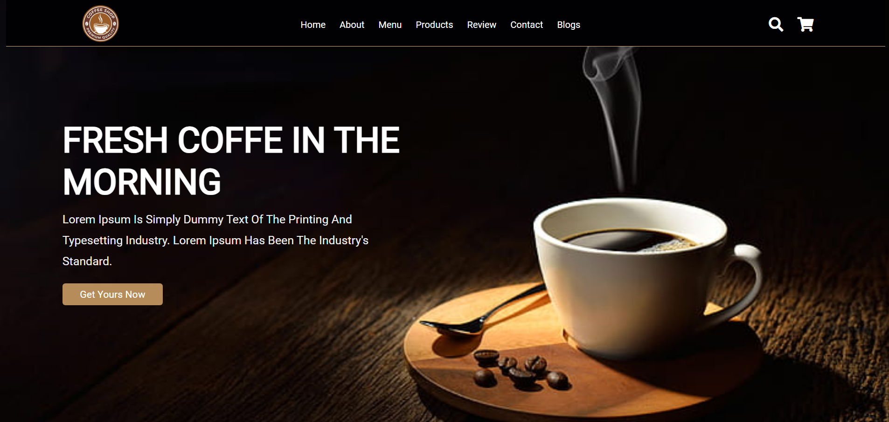
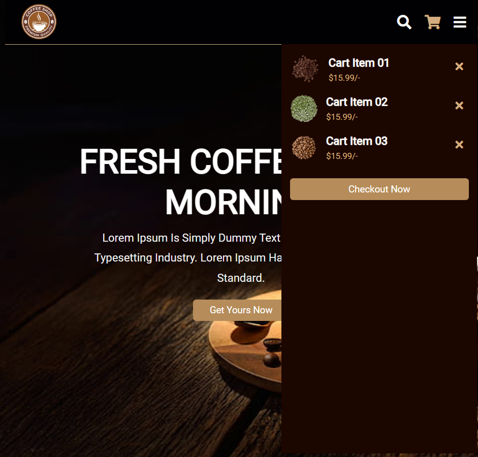

# Landing-page-coffee-shop


 Uma landing page responsiva sobre uma página de café que desenvolvi junto com um vídeo do YouTube para treinar minhas habilidades em HTML, CSS e Java Script. Você pode acessar meu projeto através do link do repositório.
 
# Como executar o projeto

```bash
# clonar repositório
git clone https://github.com/eduardavieira-dev/Landing-page-coffee-shop.git
# executar o comando npm start

```
